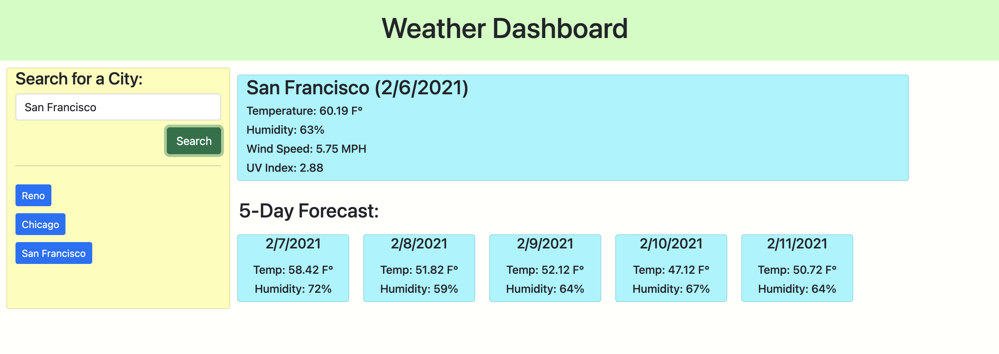

# [Weather-Dashboard](https://raffee1989.github.io/Weather-Dashboard/)
## Description
This homework was intended to work with API. I had to create an application where the users were able to search for the weather of a city they are looking for. I spent too much time making this happen. User is able to see the next five day forecast for the same city. User can look for below weather conditions:

* Weather conditions:
   1. Temperature
   1. Humidity
   1. Wind Speed
   1. UV Index

## Mock-Up

## Deployed Link

Please click [Here](https://raffee1989.github.io/Weather-Dashboard/) to see the application.